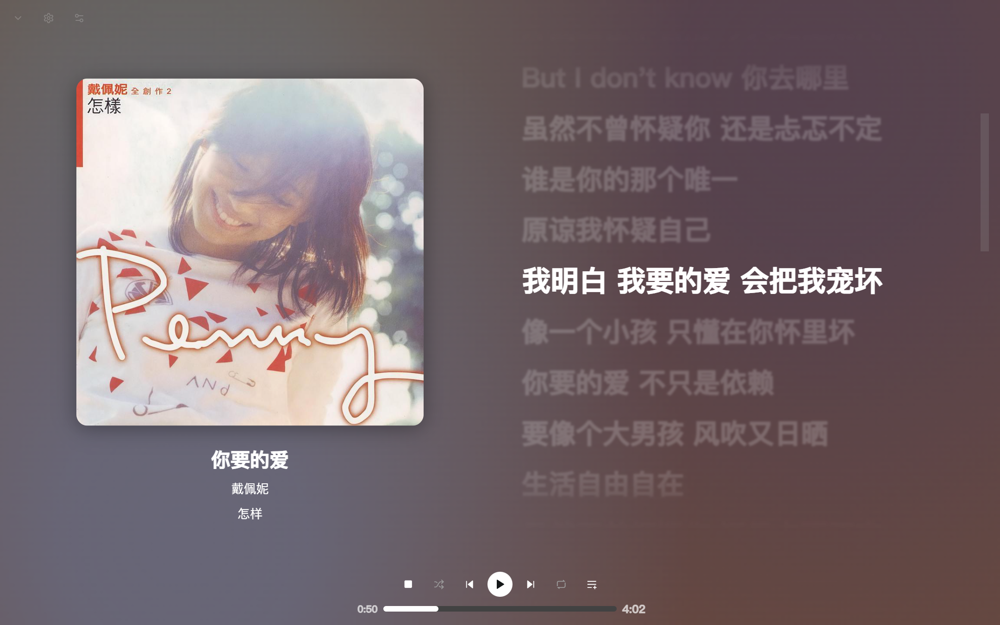
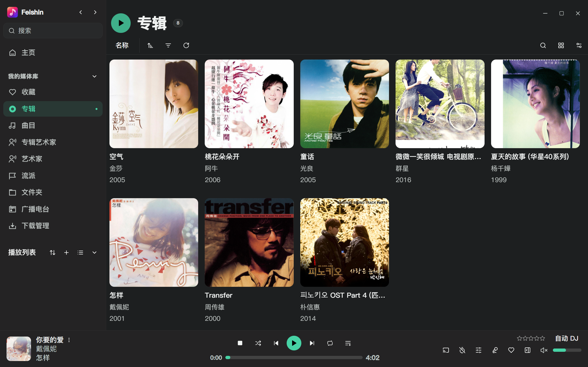
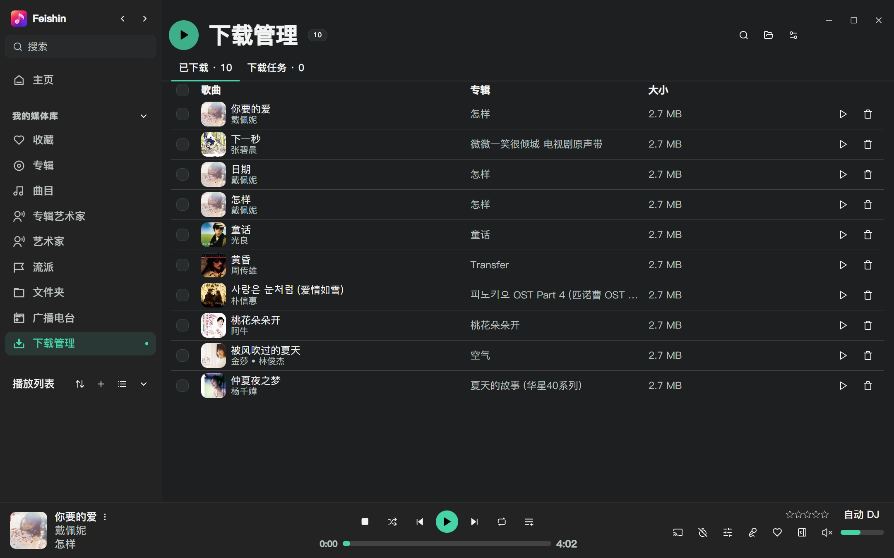
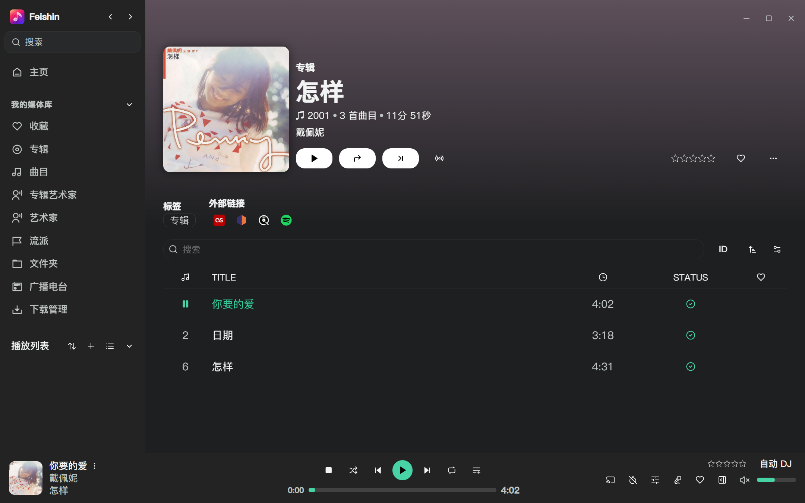

# Feishin · 2.0 Beta

面向自托管音乐服务的跨平台播放器，支持 Navidrome、Jellyfin 和兼容 Subsonic / OpenSubsonic API 的服务器。本分支在 Feishin 的基础上，重点扩展**离线使用、下载管理和桌面播放体验**。

[](LICENSE)
[](https://github.com/liristy/feishin/releases)

[下载安装](https://github.com/liristy/feishin/releases) · [问题反馈](https://github.com/liristy/feishin/issues) · [下载与离线说明](docs/OFFLINE.md) · [上游项目](https://github.com/jeffvli/feishin)

> 本仓库是独立维护的 Feishin 分支。`2.0.0-beta.1` 是本分支的版本号，不代表上游 Feishin 的官方版本。Beta 为预发布版本，安装文件及已知问题以本仓库 Release 说明为准。

## 2.0 新增功能

### 下载管理

- 通过歌曲、专辑、歌手、文件夹或播放列表的右键菜单添加下载，在统一的“下载管理”页面查看已下载歌曲与下载任务。
- 支持进度查看、取消、失败重试，以及按搜索结果批量选择、删除或管理任务。
- 歌曲列表显示下载状态；已下载内容支持播放、定位本地文件和打开音乐目录。
- 音频以独立文件保存。服务器提供有效媒体库相对路径时，保留其目录结构；否则按歌手和专辑组织，并处理文件名冲突。Navidrome 的 `.strm` 条目下载后按实际音频格式保存。

### 边听边存与本地优先播放

- “边听边存”默认开启，可在下载管理的设置中关闭。播放时通过独立请求保存音频，完整下载后纳入同一个本地音乐目录。
- MPV 和内置播放器优先播放已保存的本地文件；未保存的曲目仍需连接服务器。
- 设备断网时，播放队列可跳过尚未下载的歌曲，保留队列条目；没有可播放的本地歌曲时停止播放。
- 在启用播放队列恢复的情况下，重新启动后恢复队列和当前位置，并保留音量设置；不会在启动时自动开始播放。

### 离线浏览

- 已保存登录信息的服务器在无法联网时仍可进入，无需先通过启动连接检查。
- 已访问的列表、详情与封面持久保存在本地；服务器不可达时，使用已有缓存及下载记录展示可用内容。
- 对本地已有记录支持分页、排序、搜索和常用筛选，无需手动切换离线模式。
- 已缓存的封面可用于音乐库、侧栏及全屏播放器；缺少所需分辨率时，可复用同一封面的已有尺寸。

## 与原版 Feishin 的区别

以下比较以上游提交 [`02bfa68d`](https://github.com/jeffvli/feishin/commit/02bfa68d88dc95f5f1f9e4d11a7433bf63e5fef6) 为基线，对应本分支引入定制改动前的代码。上游后续版本可能有所变化。

| 项目 | 上游基线 | 本分支 2.0 Beta |
| --- | --- | --- |
| 下载方式 | 将服务器下载地址交给桌面下载器或浏览器处理 | 增加应用内任务管理、本地歌曲索引及批量操作 |
| 离线使用 | 启动与服务器切换包含连接验证流程 | 使用保存的登录信息进入应用，并读取已缓存的音乐库内容 |
| 音频保存 | 未提供本分支的边听边存与本地索引联动 | 播放时可自动保存音频，MPV 和内置播放器优先使用本地文件 |
| 全屏播放器 | 上游全屏播放器布局与背景效果 | 调整封面、队列和控制栏布局，增加基于封面配色的流动背景 |
| 歌词交互 | 上游歌词显示与跟随行为 | 手动浏览时暂缓自动跟随，离开后恢复；突出当前歌词行 |
| Windows 播放体验 | 用户自行配置 MPV；使用上游媒体控制实现 | Windows x64 包含固定版本 MPV，并改进系统媒体面板、任务栏按钮与播放状态同步 |
| 界面与发布渠道 | 上游图标、默认主题和更新来源 | 调整图标、默认主题、侧栏与列表布局；更新与发布说明指向本仓库 |

上表包含本分支在 1.x 阶段已引入、并由 2.0 延续的改动。MPV / 内置双播放引擎、服务器曲库浏览、播放列表、歌词、Navidrome 智能播放列表等能力来自上游，仍是本项目的基础功能；具体可用功能取决于服务器实现。

## 界面预览

以下图片由当前版本的真实界面生成，使用独立演示配置。歌曲及封面用于展示；不含个人账号、服务器地址、播放历史或收藏记录，页面中的本地文件信息为演示数据。

### 全屏播放器

以戴佩妮《你要的爱》为例，展示封面配色背景与歌词。



### 音乐库



### 下载管理



### 专辑详情



## 安装与使用

### 桌面端

从[本仓库 Releases](https://github.com/liristy/feishin/releases)选择对应操作系统及处理器架构的文件。Beta 版本会标注为预发布版本；请勿将上游安装包、Flathub 分发包或上游托管网页视为本分支的发行版本。

| 平台 | 构建格式 | MPV 配置 |
| --- | --- | --- |
| Windows | 安装程序、ZIP 压缩包 | x64 构建包含 MPV；其他架构需自行准备兼容的 MPV，或选择内置播放器 |
| macOS | DMG、ZIP 压缩包 | 使用 MPV 时需自行安装并设置可执行文件路径 |
| Linux | AppImage、DEB、tar.xz | 使用 MPV 时需自行安装并设置可执行文件路径 |

各次发布提供的架构和文件以 Release 附件为准。macOS 的系统权限提示及 Linux 的桌面集成行为取决于系统配置。

1. 安装或解压应用，在服务器管理中添加 Navidrome、Jellyfin 或 Subsonic / OpenSubsonic 服务器。
2. 输入完整服务器地址及账号信息。本项目是音乐客户端，需要已有音乐服务器，不提供音乐内容服务。
3. 在播放设置中选择 MPV 或内置播放器。内置播放器支持的音频格式取决于 Chromium；可使用 MPV 播放其支持的其他格式。
4. 如需离线使用，先联网浏览所需内容，并下载歌曲。完整保存的歌曲会出现在“下载管理”的“已下载”列表中。
5. 在下载管理的设置中查看保存目录，并根据需要开启或关闭“边听边存”。默认目录位于系统音乐文件夹下的 `Feishin` 目录。

### 使用范围与限制

- **离线内容有限**：仅能访问已缓存或已下载的内容，不能在断网时获得未保存的完整服务器音乐库。自定义服务器筛选表达式不能在本地执行。
- **下载不是断点续传**：最多同时处理两个任务。未完成的文件不能离线播放，退出应用时未完成的任务需要重新发起。
- **存储与流量**：“边听边存”会增加独立下载流量；音频目录不设自动容量上限，也不自动淘汰旧文件，可在下载管理中删除不再需要的内容。
- **联网功能**：网络电台、DLNA 和服务器点唱机仍需网络。离线期间不提交播放记录、不自动保存服务器队列、不执行自动 DJ；离线播放记录不会在恢复连接后补传。
- **客户端差异**：桌面端提供本地音频下载与音乐目录管理。网页版仅提供已访问数据和图片的持久缓存，不具备桌面端的本地音频管理功能。

详细行为见[下载与离线说明](docs/OFFLINE.md)。

### Web 与 Docker

可从本仓库源码构建网页版或 Docker 镜像。上游的在线演示站点和 `ghcr.io/jeffvli/feishin` 镜像由上游维护，不包含本分支的全部改动。

```sh
docker build -t feishin-local .
docker run --name feishin -p 9180:9180 feishin-local
```

服务器预配置可使用 `SERVER_NAME`、`SERVER_TYPE`、`SERVER_URL`；同时设置 `SERVER_LOCK=true` 可锁定服务器配置。设置覆盖项见[环境变量文档](docs/ENV_SETTINGS.md)。

## 从源码构建

使用与项目依赖兼容的 Node.js，并按 [`package.json`](package.json) 的 `packageManager` 字段配置 pnpm。

```sh
pnpm install --frozen-lockfile
pnpm dev
```

| 命令 | 用途 |
| --- | --- |
| `pnpm build` | 构建 Electron 应用及远程控制页面 |
| `pnpm build:web` | 构建网页版，输出到 `out/web` |
| `pnpm package:win:pr` | 构建 Windows 安装包，不上传发布 |
| `pnpm package:mac:pr` | 构建 macOS 安装包，不上传发布 |
| `pnpm package:linux:pr` | 构建 Linux 安装包，不上传发布 |

Windows x64 打包过程会准备并校验内置 MPV。开发环境下的准备方法及第三方许可见 [MPV 说明](assets/mpv/README.md)。

## 反馈、来源与许可

本分支的问题请提交至[本仓库 Issues](https://github.com/liristy/feishin/issues)，并提供版本号、操作系统、服务器类型及复现步骤。提交日志或截图前，请移除密码、访问令牌、服务器地址及其他不宜公开的信息。

本项目基于 [jeffvli/feishin](https://github.com/jeffvli/feishin)，保留上游作者及贡献者的版权声明。感谢上游提供播放器及服务器集成基础。

代码遵循 [GNU GPL v3](LICENSE)。第三方组件遵循各自许可；截图中的音乐作品、封面及相关标识的权利归各自权利人所有。
