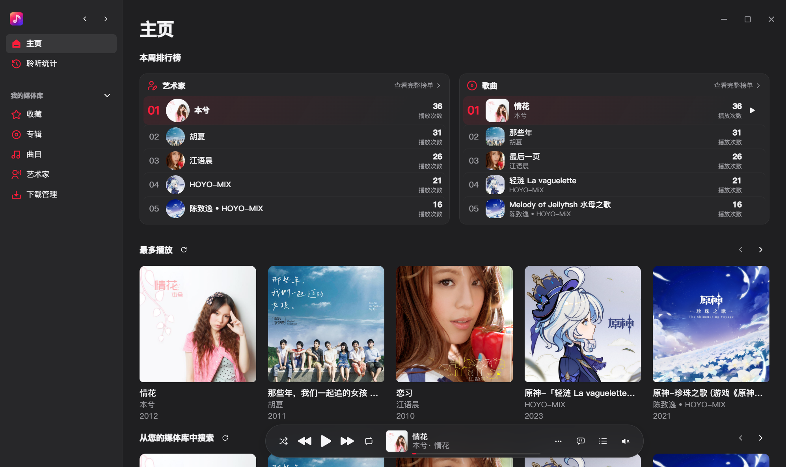
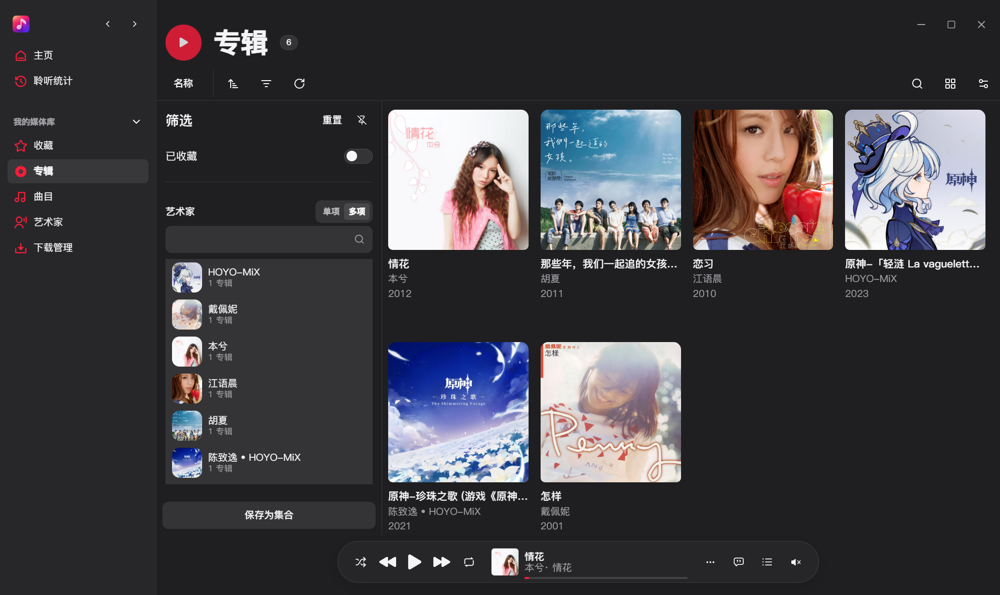
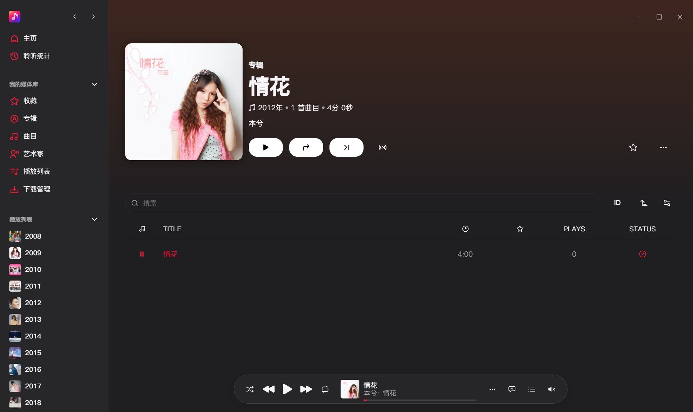
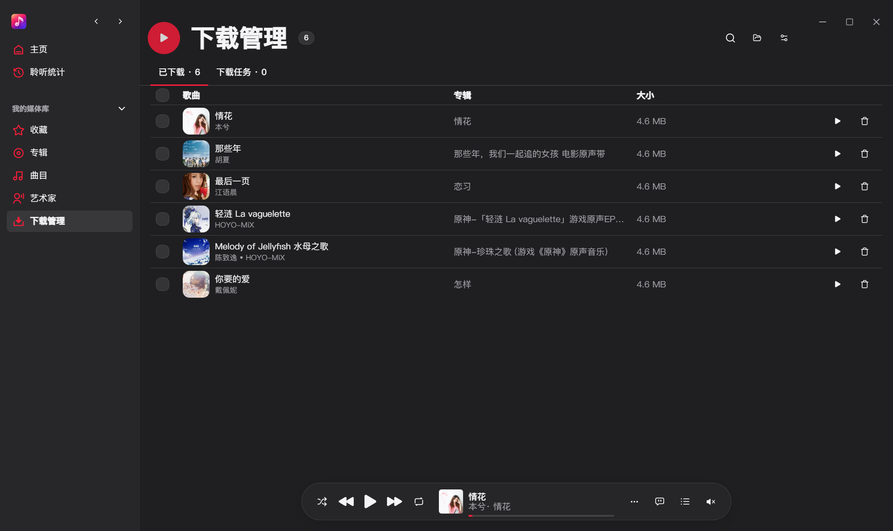

# qMusic for Windows

连接自己的音乐库，以 Apple Music 风格的界面浏览、收藏和播放音乐。

qMusic 基于 Feishin，支持 **Navidrome、Jellyfin 和 Subsonic / OpenSubsonic**，提供悬浮播放条、全屏歌词、聆听统计、下载管理与离线播放。

[](LICENSE)
[](https://github.com/liristy/feishin/releases)

[下载 beta5](https://github.com/liristy/feishin/releases/tag/v2.0.0-beta.5) · [更新内容](docs/releases/2.0.0-beta.5.md) · [问题反馈](https://github.com/liristy/feishin/issues) · [下载与离线说明](docs/OFFLINE.md)

> 当前版本：**2.0.0-beta.5**。本次仅发布 Windows x64 与 ARM64 安装包。qMusic 是独立维护的 Feishin 分支，Beta 为预发布版本。



## 新版界面

- **主页**：保留常听、随机推荐、最近添加和最近播放等内容，以紧凑的本周排行榜查看聆听趋势。
- **侧栏**：统一图标和导航，聆听统计位于主页下方；向上滚动时显示搜索，播放列表可独立滚动。
- **悬浮播放条**：歌曲信息、播放控制、进度条与音量集中呈现，播放队列和更多操作通过浮层打开。
- **全屏播放器**：从播放条展开，显示高清封面、流动背景与同步歌词，关闭时回到播放条。
- **歌词**：突出当前歌词行，支持手动浏览、偏移调节和多语言显示。可用歌词与语言取决于音乐服务器。

### 全屏播放器


### 媒体库



### 专辑详情



## 下载与离线播放



### 下载管理

- 通过歌曲、专辑、歌手、文件夹或播放列表的右键菜单添加下载，在统一的“下载管理”页面查看已下载歌曲与下载任务。
- 支持进度查看、取消、失败重试，以及按搜索结果批量选择、删除或管理任务。
- 歌曲列表显示下载状态；已下载内容支持播放、定位本地文件和打开音乐目录。
- 音频以独立文件保存。服务器提供有效媒体库相对路径时，保留其目录结构；否则按歌手和专辑组织，并处理文件名冲突。Navidrome 的 `.strm` 条目下载后按实际音频格式保存。

### 边听边存与本地优先播放

- “边听边存”默认开启，可在下载管理的设置中关闭。播放时通过独立请求保存音频，完整下载后纳入同一个本地音乐目录。
- MPV 和内置播放器优先播放已保存的本地文件；未保存的曲目仍需连接服务器。
- 设备断网时，播放队列可跳过尚未下载的歌曲，保留队列条目；没有可播放的本地歌曲时停止播放。
- 在启用播放队列恢复的情况下，重新启动后恢复队列和当前位置，并保留音量设置；不会在启动时自动开始播放。

### 离线浏览

- 已保存登录信息的服务器在无法联网时仍可进入，无需先通过启动连接检查。
- 已访问的列表、详情与封面持久保存在本地；服务器不可达时，使用已有缓存及下载记录展示可用内容。
- 对本地已有记录支持分页、排序、搜索和常用筛选，无需手动切换离线模式。
- 已缓存的封面可用于音乐库、侧栏及全屏播放器；缺少所需分辨率时，可复用同一封面的已有尺寸。

## 安装与使用

### 桌面端

从[本仓库 Releases](https://github.com/liristy/feishin/releases)下载安装程序或 ZIP 压缩包，按设备选择 x64 或 ARM64。自动接收预发布更新时，在高级设置中将更新通道设为 **Beta**。

| 架构 | 安装包 | 播放引擎 |
| --- | --- | --- |
| Windows x64 | EXE、ZIP | 内置 MPV，也可使用内置播放器 |
| Windows ARM64 | EXE、ZIP | 使用内置播放器，或自行配置兼容的 MPV |

各次发布提供的文件以 Release 附件为准。macOS 和 Linux 可从源码构建，beta5 不提供这两个平台的安装包。

1. 安装或解压应用，在服务器管理中添加 Navidrome、Jellyfin 或 Subsonic / OpenSubsonic 服务器。
2. 输入完整服务器地址及账号信息。本项目是音乐客户端，需要已有音乐服务器，不提供音乐内容服务。
3. 在播放设置中选择 MPV 或内置播放器。内置播放器支持的音频格式取决于 Chromium；可使用 MPV 播放其支持的其他格式。
4. 如需离线使用，先联网浏览所需内容，并下载歌曲。完整保存的歌曲会出现在“下载管理”的“已下载”列表中。
5. 在下载管理的设置中查看保存目录，并根据需要开启或关闭“边听边存”。为兼容已有下载，默认目录仍位于系统音乐文件夹下的 `Feishin` 目录。

### 使用范围与限制

- **离线内容有限**：仅能访问已缓存或已下载的内容，不能在断网时获得未保存的完整服务器音乐库。自定义服务器筛选表达式不能在本地执行。
- **下载不是断点续传**：最多同时处理两个任务。未完成的文件不能离线播放，退出应用时未完成的任务需要重新发起。
- **存储与流量**：“边听边存”会增加独立下载流量；音频目录不设自动容量上限，也不自动淘汰旧文件，可在下载管理中删除不再需要的内容。
- **联网功能**：网络电台、DLNA 和服务器点唱机仍需网络。离线期间不提交播放记录、不自动保存服务器队列、不执行自动 DJ；离线播放记录不会在恢复连接后补传。
- **客户端差异**：桌面端提供本地音频下载与音乐目录管理。网页版仅提供已访问数据和图片的持久缓存，不具备桌面端的本地音频管理功能。

详细行为见[下载与离线说明](docs/OFFLINE.md)。

### Web 与 Docker

可从本仓库源码构建网页版或 Docker 镜像。上游的在线演示站点和 `ghcr.io/jeffvli/feishin` 镜像由上游维护，不包含本分支的全部改动。

```sh
docker build -t qmusic-local .
docker run --name qmusic -p 9180:9180 qmusic-local
```

服务器预配置可使用 `SERVER_NAME`、`SERVER_TYPE`、`SERVER_URL`；同时设置 `SERVER_LOCK=true` 可锁定服务器配置。设置覆盖项见[环境变量文档](docs/ENV_SETTINGS.md)。

## 从源码构建

使用与项目依赖兼容的 Node.js，并按 [`package.json`](package.json) 的 `packageManager` 字段配置 pnpm。

```sh
pnpm install --frozen-lockfile
pnpm dev
```

| 命令 | 用途 |
| --- | --- |
| `pnpm build` | 构建 Electron 应用及远程控制页面 |
| `pnpm build:web` | 构建网页版，输出到 `out/web` |
| `pnpm package:win:pr` | 构建 Windows 安装包，不上传发布 |
| `pnpm package:mac:pr` | 构建 macOS 安装包，不上传发布 |
| `pnpm package:linux:pr` | 构建 Linux 安装包，不上传发布 |

Windows x64 打包过程会准备并校验内置 MPV。开发环境下的准备方法及第三方许可见 [MPV 说明](assets/mpv/README.md)。

## 仓库导航

| 目录 | 内容 |
| --- | --- |
| `src/` | 桌面主进程、预加载接口、播放器界面、远程控制页面及共享代码 |
| `assets/`、`resources/` | 应用运行资源、图标及 MPV 配置 |
| `build/` | Docker 模板、Linux AppStream 元数据及 macOS 权限声明 |
| `scripts/build/` | 构建和发布辅助脚本 |
| `scripts/tests/` | 按 Node.js、Electron 和 Windows 工具分类的回归检查 |
| `docs/` | 使用说明、开发约定和历史发布说明 |
| `media/` | README 截图、标识及设计源文件 |
| `.github/workflows/` | 检查、打包与发布工作流 |

文档入口见[文档索引](docs/README.md)，测试与构建脚本的运行方法见[脚本说明](scripts/README.md)。`out/`、`dist/`、`node_modules/` 和 `.scratch/` 为本地产物或工作目录，不纳入 Git；临时截图、日志和安装备份统一保存在 `.scratch/`。

## 反馈、来源与许可

本分支的问题请提交至[本仓库 Issues](https://github.com/liristy/feishin/issues)，并提供版本号、操作系统、服务器类型及复现步骤。提交日志或截图前，请移除密码、访问令牌、服务器地址及其他不宜公开的信息。

本项目基于 [jeffvli/feishin](https://github.com/jeffvli/feishin)，保留上游作者及贡献者的版权声明。感谢上游提供播放器及服务器集成基础。

代码遵循 [GNU GPL v3](LICENSE)。第三方组件遵循各自许可；截图中的音乐作品、封面及相关标识的权利归各自权利人所有。
